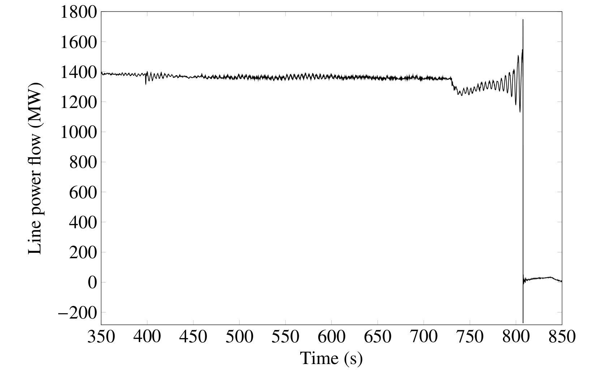

## 2nd Ed.: An Introduction to Oscillation Analysis and Control

<div style="display: flex; justify-content: left;" width="100%">
    
</div>

## Welcome
Welcome to the homepage for Power System Oscillations, Second
Edition. The [Navigating the homepage](#navigating-the-homepage)
section will help point you in the right direction.

## Contact
For issues and feedback related to the code that accompanies the
book, we would appreciate it if you could use the
[Issues feature](https://github.com/PowerSystemOscillations/PowerSystemOscillations.github.io/issues)
of this repository. This helps others join the discussion and helps
us keep track of and document issues. This is also a good way to
inform us about typos or potential errors in the book itself. In
addition to the Issues feature, we welcome feedback at the email
addresses below.

### Email
| Role                | Contact                               |
| ------------------- | ------------------------------------- |
| Author team account | `@gmail.com: PowerSystemOscillations` |
| Project maintainer  | `@ieee.org: ryanelliott`              |

### Dedication
This second edition is dedicated to the memory of Graham Rogers, a
modest scientist and engineer, whose contributions to power system
small-signal analysis are immense.

### Authors
Graham J. Rogers, *Cherry Tree Scientific Software*<br />
Ryan T. Elliott, *Sandia National Laboratories*<br />
Daniel J. Trudnowski, *Montana Tech*<br />
Felipe Wilches-Bernal, *formerly with Sandia National Laboratories*<br />
Denis Osipov, *New York Power Authority*<br />
Joe H. Chow, *Rensselaer Polytechnic Institute*

Author bios may be [found here](abstracts/bios.md).

## License
This project is licensed under the Creative Commons CC BY-NC 4.0
license--see the
[LICENSE](https://github.com/PowerSystemOscillations/PowerSystemOscillations.github.io/blob/main/LICENSE)
file for details.

## Recommended citation

### IEEE style

    G. Rogers, R. Elliott, D. Trudnowski, F. Wilches-Bernal, D. Osipov,
    J. Chow, Power System Oscillations: An Introduction to Oscillation
    Analysis and Control, 2nd Ed., New York, NY: Springer, 2025.

### BibTeX
```bibtex
@book{rogers2025,
  title     = {Power System Oscillations: An Introduction to
               Oscillation Analysis and Control},
  edition   = {Second},
  author    = {Rogers, Graham J. and Elliott, Ryan T.
               and Trudnowski, Daniel J. and Wilches-Bernal, Felipe
               and Osipov, Denis and Chow, Joe H.},
  publisher = {Springer},
  address   = {New York},
  year      = 2025
}
```

## Errata

Errors and typographical mistakes found in the book will be
[tracked here](abstracts/errata.md).

## Navigating the homepage

- [Purchasing the book](#purchasing-the-book)
- [Power System Toolbox for MATLAB](#power-system-toolbox-for-matlab)
- [Data and analysis files](#data-and-analysis-files)
- [Book overview](#book-overview)
- [Frequently asked questions](#frequently-asked-questions)
- [References](#references)

## Purchasing the book

If you would like to purchase the book, you may do so below:
+ Visit the [Springer webpage here](https://link.springer.com/book/10.1007/978-3-031-80581-3).
+ Or purchase the book [on Amazon here](https://www.amazon.com/Power-System-Oscillations-Introduction-Oscillation/dp/3031805801).

## Power System Toolbox for MATLAB

The Power System Toolbox (PST) for MATLAB is a user-developed package
for simulating and analyzing the behavior of large-scale power
systems. This repository contains three versions of PST intended for
different purposes, [summarized here](software/README.md). To acquire
these packages, you may [clone this repository](https://github.com/PowerSystemOscillations/PowerSystemOscillations.github.io)
or [download them individually](https://github.com/PowerSystemOscillations/PowerSystemOscillations.github.io/tree/main/software).

For active research, we recommend using The Power and Energy Storage
System Toolbox (PSTess), which is an open-source software project
[hosted on GitHub](https://github.com/sandialabs/snl-pstess).

## Data and analysis files

This repository contains numerous data files and MATLAB scripts
corresponding to examples presented in the book. To access them,
you may [clone this repository](https://github.com/PowerSystemOscillations/PowerSystemOscillations.github.io)
or [download the files individually](https://github.com/PowerSystemOscillations/PowerSystemOscillations.github.io/tree/main/data). Some of the example
files for Chapters 11--15 are currently under construction,
so please check back at a future date.

## Book overview

- Front Matter
    - [About](abstracts/about.md)
    - [Preface](abstracts/preface.md)
    - [Chapter 1: Introduction](abstracts/chapter1.md)
- Part I: Modal Analysis
    - [Chapter 2: The Nature of Power System Oscillations](abstracts/chapter2.md)
    - [Chapter 3: Modal Analysis of Power Systems](abstracts/chapter3.md)
    - [Chapter 4: Modal Analysis for Control](abstracts/chapter4.md)
    - [Chapter 5: Power System Structure and Oscillations](abstracts/chapter5.md)
    - [Chapter 6: Generator Controls](abstracts/chapter6.md)
    - [Chapter 7: Power System Stabilizers](abstracts/chapter7.md)
    - [Chapter 8: Power System Stabilizer Implementation--Problems and Solutions](abstracts/chapter8.md)
- Part II: Robust Control
    - [Chapter 9: Robust Control](abstracts/chapter9.md)
    - [Chapter 10: Damping by Electronic Power System Devices](abstracts/chapter10.md)
- Part III: Robust Control
    - [Chapter 11: Synchrophasor Measurement Systems](abstracts/chapter11.md)
    - [Chapter 12: Measurement-Based Modal Analysis](abstracts/chapter12.md)
    - [Chapter 13: Wide-Area Control](abstracts/chapter13.md)
    - [Chapter 14: Forced Oscillations](abstracts/chapter14.md)
    - [Chapter 15: Inverter-Based Resources](abstracts/chapter15.md)

## Frequently asked questions

> What should I do if I find an error in an analysis script or a typo in the book?

Please use the
[Issues feature](https://github.com/PowerSystemOscillations/PowerSystemOscillations.github.io/issues)
of this repository. This helps others join the discussion and helps
us keep track of and document issues. Alternatively, you can contact
the author team [via email here](mailto:PowerSystemOscillations@gmail.com).

## References

G. Rogers, *Power System Oscillations*, 1st ed., ser. Power
Electronics and Power Systems. Springer, 2000.

G. Rogers, R. Elliott, D. Trudnowski, F. Wilches-Bernal, D. Osipov,
and J. H. Chow, *Power System Oscillations: An Introduction to
Oscillation Analysis and Control*, 2nd ed. Springer, 2025.

J. Chow and K. Cheung, "A toolbox for power system dynamics and
control engineering education and research," *IEEE Trans. Power
Syst.*, vol. 7, no. 4, pp. 1559–1564, 1992.

J. Chow, "Power System Toolbox Version 3.0 manual." Available:
[https://www.ecse.rpi.edu/~chowj/PSTMan.pdf](https://www.ecse.rpi.edu/~chowj/PSTMan.pdf).

R. Elliott, D. Trudnowski, H. Choi, and T. Nguyen, "The Power and
Energy Storage Systems Toolbox – PSTess Version 1.0," SAND2021-11259,
Sept. 2021. Available:
[https://www.sandia.gov/ess-ssl/](https://www.sandia.gov/ess-ssl/wp-content/uploads/2021/09/sand2021_11259_pstess_elliott_choi.pdf).

[comment]: <> (eof)
