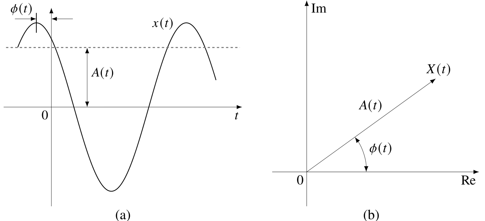

# Chapter 11: Synchrophasor Measurement Systems
## Abstract
In Part I of this book, analytical models are developed to analyze
the electromechanical modes of a power system. More recently, with
government and industry initiatives, phasor measurement units (PMUs)
have been installed extensively in power systems all over the
world. In US and Canada, there are more than 2000 PMUs installed on
transmission system and generator substations as of 2020. This
chapter provides some background on phasors and PMUs, that is, the
computation of voltages and currents as positive sequence phasor
signals. In addition, PMU data transmission via computer networking
is described, allowing the establishment of power system wide-area
monitoring systems.

    <figure>
        
        <figcaption>Fig. 11.1: Time-domain vs. phasor representation</figcaption>
    </figure>

[comment]: <> (eof)
