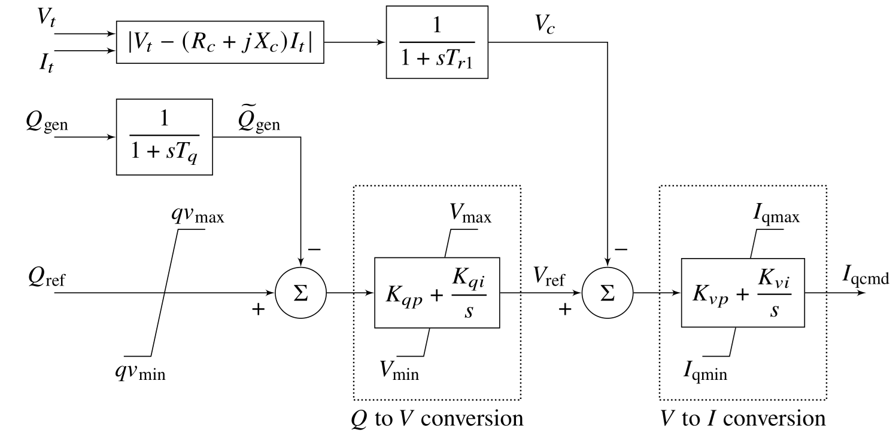

# Chapter 15: Inverter-Based Resources
## Abstract
This chapter explores the impact of inverter-based resources (IBRs) on
the oscillatory characteristics of bulk electric systems. It focuses
primarily on the electromechanical modes of oscillation and
low-frequency control modes that can be studied using phasor-domain
tools. Two inverter control models approved for use in transmission
planning studies, one grid-following and one grid-forming, are
investigated. We use linearization and eigenanalysis to determine the
sensitivity of local and inter-area modes of oscillation to increases
in the penetration of IBRs. Discrete effects arising from synchronous
machines being displaced by renewable generation are also explored. To
illustrate the main concepts, analysis and simulation results are
presented for a two-area test system augmented with solar photovoltaic
generation. All analysis is performed in MATLAB using the Power and
Energy Storage Systems Toolbox (PSTess). This package is an extension
of PST designed for studying systems with a mix of conventional and
inverter-based resources.

    <figure>
        
        <figcaption>Fig. 15.1: Simplified block diagram of the reec reactive power-voltage control</figcaption>
    </figure>

[comment]: <> (eof)
