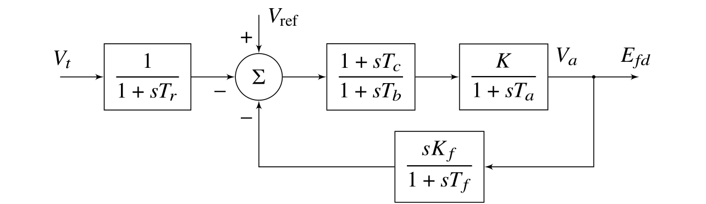

# Chapter 3: Modal Analysis of Power Systems
## Abstract
In Chapter 2, we discussed the oscillations that may occur in
interconnected power systems. By looking at different models, and
with different disturbances, we showed examples of the different
types of oscillation that can occur. To do this, we performed a
considerable number of 10-second nonlinear simulations. It is
apparent that in larger systems the use of transient simulation for
the analysis of system oscillations could be very time consuming. To
study inter-area oscillations, it is often necessary to run
simulations for longer than 10 seconds. In practice, 30 seconds is
quite common. Not only is the use of nonlinear simulation time
consuming, but also it is often difficult to interpret the
results. Larger systems may have a number of inter-area modes at very
similar frequencies, and it can be quite difficult to separate them
from a response in which more than one is excited.

    <figure>
        
        <figcaption>Fig. 3.1: Block diagram of a simple exciter</figcaption>
    </figure>

[comment]: <> (eof)
