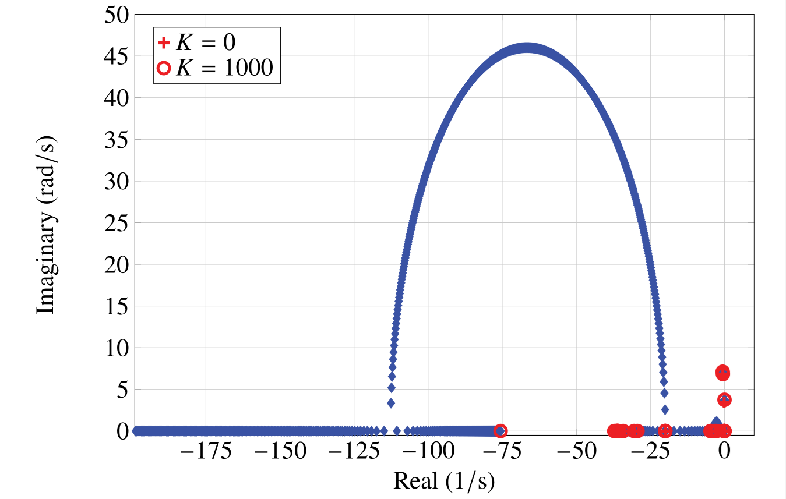

# Chapter 4: Modal Analysis for Control
## Abstract
In Chapter 3, we defined and applied modal analysis to
understanding the nature of power system oscillations. However, it is
necessary to do more than understand; controls, which modify the
natural behavior of the interconnected synchronous generators, must
be designed. While power systems are essentially nonlinear, we have
seen that their oscillations about an operating point can be
predicted accurately from a linearized system model. For oscillation
damping control design, we can use this to justify the application of
linear control theory. In this chapter, we will examine in more
detail the control process. At the same time, we will add to the
collection of modal analysis tools, some that are particularly useful
in control design.

    <figure>
        
        <figcaption>Fig. 4.1: Root locus with negative feedback gain</figcaption>
    </figure>

[comment]: <> (eof)
