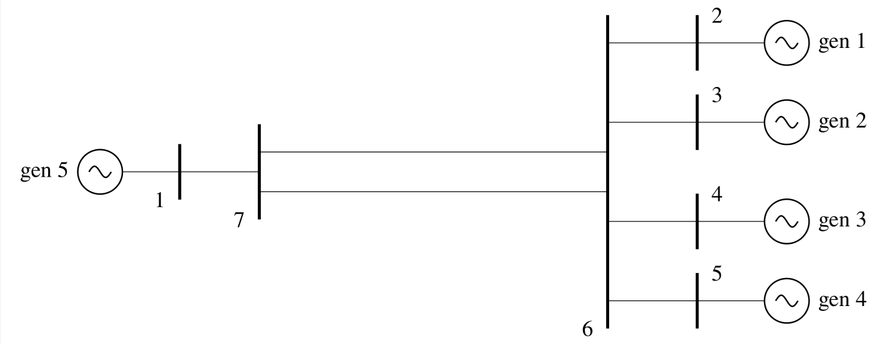

# Chapter 5: Power System Structure and Oscillations
## Abstract
Electromechanical oscillations are inherent to interconnected power
systems. However, the frequency of the oscillations and the number of
generators that oscillate in any electromechanical oscillatory mode
depend on the structure of the power system network. Low-frequency
electromechanical oscillations occur when existing generation/load
areas are connected to other similar areas by relatively weak
transmission lines. In this chapter, we will examine in more detail
the relationship between low-frequency modes and weak
interconnections in the transmission system network. The basis of the
analysis will be the observation that generators in specific areas of
a power system behave coherently in low frequency electromechanical
oscillations and that groups of coherent generators are separated
from other groups of coherent generators by weak interconnections.

    <figure>
        
        <figcaption>Fig. 5.1: Single-line diagram of four generator plant</figcaption>
    </figure>

[comment]: <> (eof)
