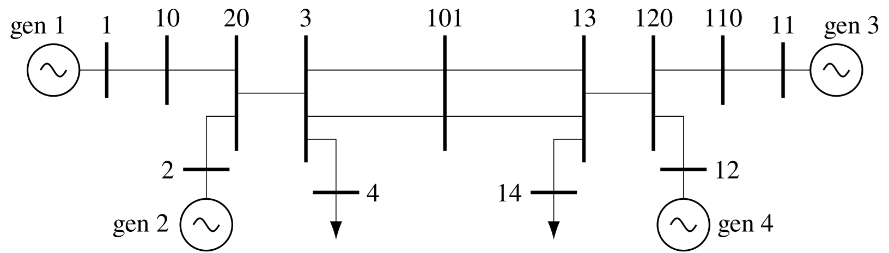

# Chapter 10: Damping by Electronic Power System Devices
## Abstract
So far, we have considered the damping of power system oscillations by
power system stabilizers that act through the excitation systems of
the generators. The generators act to amplify the power of these
controllers so that they can add damping to the electromechanical
oscillations. There are other system elements which can act as power
amplifiers, for example, high-voltage direct current links, static VAr
compensators and FACTS devices. Generally, these devices are placed in
a power system for some reason other than to add damping to power
system oscillations. However, once installed, their control design may
be able to increase the damping of certain electromechanical modes as
well as satisfying the primary requirements of the device. Because
electronic devices are not directly involved with electromechanical
oscillations, damping using these controls is not as straightforward
as damping using power system stabilizers on the generators. It is
particularly difficult to attain robustness to large changes in
operating conditions. We will show that this is due to the large
changes in the positions of the poles and zeros of the transfer
functions of the devices when the operating conditions change.

    <figure>
        
        <figcaption>Fig. 10.1: Single-line diagram of the two-area system</figcaption>
    </figure>

[comment]: <> (eof)
