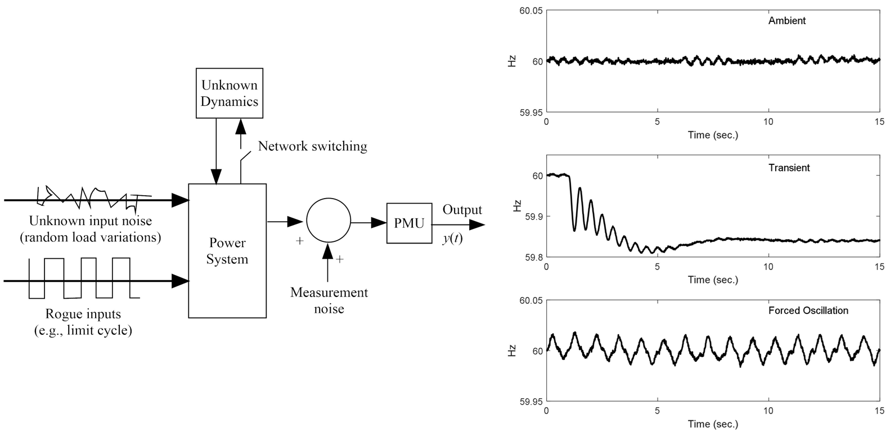

# Chapter 12: Measurement-Based Modal Analysis
## Abstract
Chapter 3 establishes the use of modal analysis to characterize
small-signal dynamic properties that are necessary for comprehending a
system's stability traits and for designing stabilizing control
systems. The foundation of the modal analysis is that small system
motions can be described by a linear ordinary differential equation
(ODE). In Chapter 3, the ODE parameters are obtained by linearizing a
nonlinear dynamic model. In this chapter, we explore methods for
obtaining a system's modal characteristics directly from actual-system
time-synchronized phasor measurements. We term this measurement-based
modal analysis. The obvious advantage of the measurement-based
approach is that it does not require a system differential equation
model. One directly analyzes actual-system measurements to obtain the
modal characteristics.

    <figure>
        
        <figcaption>Fig. 12.1: System response types</figcaption>
    </figure>

[comment]: <> (eof)
