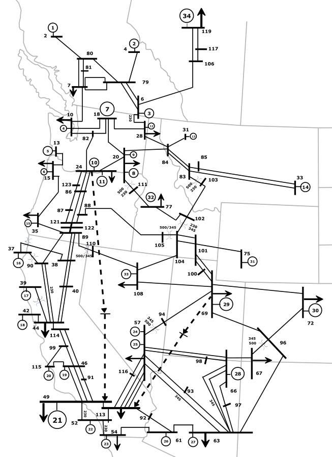

# Chapter 13: Wide-Area Control
## Abstract
Inter-area oscillations are a phenomenon that affects an entire
interconnection. They even have the potential of being destabilized
causing widespread damage. The power system community has
traditionally addressed this problem with power system stabilizers
(PSSs). PSSs are devices that act on the excitation systems of
rotating generators and have the ability to improve the dynamics of
the system. These devices are usually fed with local
signals. However, it has been shown that incorporating information to
damping controllers from remote signals can lead to improved
performance. In this chapter we assume that a suitable wide-area
control actuator has been identified, using some of the analysis
techniques discussed in Part I. Then the next task is to determine
suitable local and remote PMU signals to be used as the input
signal(s) to the damping controllers.

A superior input damping signal would result in an input-output
transfer transfer function lacking zeros near or in the right
half-plane (RHP) which are close to the inter-area modes, thus
allowing the use of higher gain controllers to achieve sufficient
inter-area damping. This chapter discusses two studies using
different strategies to deal with the reliability of the remote
signals. The first is a wide-area controller for the western
interconnection that was tested in the actual system and demonstrated
the benefits of using wide-area signals for damping control. This
controller also shows why remote signals outperform local signals in
damping applications. The chapter then presents the design of an
adaptive wide-area controller. This controller uses an adaptive
switching controller to compensate for network latencies in the
remote synchrophasor signals to derive its control action.

    <figure>
        
        <figcaption>Fig. 13.2: Western Interconnection simplified model</figcaption>
    </figure>

[comment]: <> (eof)
