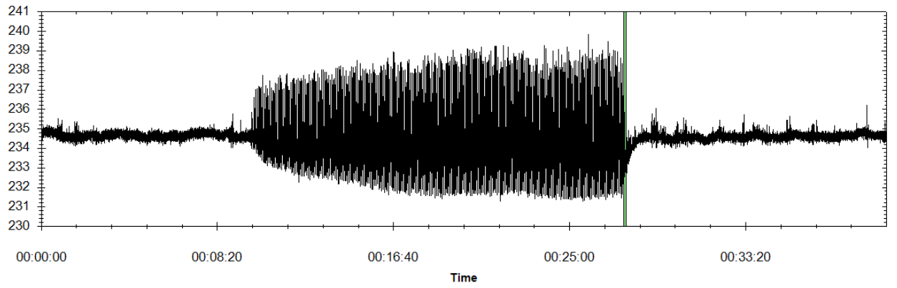

# Chapter 14: Forced Oscillations
## Abstract
In recent years there have been an increase in recorded oscillations
that cannot be simply explained by examining the model of the
system. These sustained oscillations are initiated by an external or
unintended periodic input to the power system and are called forced
oscillations. The increased number of recorded forced oscillation
events can be analyzed using wide-area measurement systems based on
phasor measurement units, which provide improved grid
observability. A common cause of forced oscillations is malfunction
of a steam valve at a thermal power plant such that the valve cycles
between the on and off positions due to either a mechanical or
control system failure. This kind of malfunction leads to four major
forced-oscillation events in the North America power grids. In order
to quickly mitigate negative consequences of a forced oscillation, it
is necessary to identify the source of the oscillation and either
correct the malfunctioning source or disconnect it from the
grid. This chapter describes factors influencing oscillation source
identification and practical approaches to locate the source of the
oscillation. The techniques are demonstrated in a set of examples
using power system models of different complexity as well as actual
measurements from the North America Eastern Interconnection.

    <figure>
        
        <figcaption>Fig. 14.1: Bus Voltage Magnitude&mdash;January 11, 2019 Eastern Interconnection system</figcaption>
    </figure>

[comment]: <> (eof)
