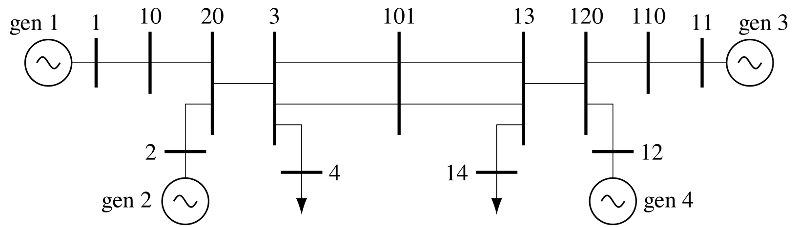

# Chapter 2: The Nature of Power System Oscillations
## Abstract
Power system oscillations are complex, and they are not straightforward to analyze. Therefore, before going into any detail, we will use an example to show the basic types of oscillations that can occur. The example two-area system is artificial; its model was created for a research report commissioned from Ontario Hydro by the Canadian Electrical Association to exhibit the different types of oscillations that occur in both large and small interconnected power systems. There are two generation and load areas interconnected by transmission lines. Each area has two generators. The generators and their controls are identical. The system is quite heavily stressed; it has 400 MW flowing on the tie lines from area 1 to area 2. In all cases, the active load is modeled as 50% constant current and 50% constant impedance; the reactive load is modeled as constant impedance. Using the two-area system as the basis, we will discuss the different types of oscillations that can occur in this system and, by implication, other interconnected systems.

    <figure>
        
        <figcaption>Fig. 2.1: Single-line diagram of the two-area system</figcaption>
    </figure>

[comment]: <> (eof)
