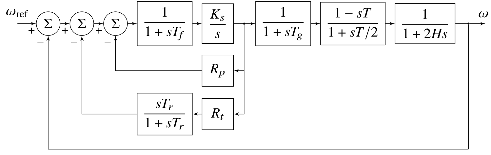

# Chapter 6: Generator Controls
## Abstract
In this chapter, we will discuss some aspects of the normal generator
controls, i.e., the speed governor and the automatic voltage
control. It is normal for these controls to be set up more or less
independently of the requirements of the generator in an
interconnected system. The governor's purpose is to control speed, and
an exciter with an automatic voltage regulator is used to control
generator terminal voltage. Or at least this is the stated
purpose. Once a generator is synchronously interconnected with other
generators, the system plays an important part in both speed and
voltage control. When generators are synchronized, their steady-state
electrical speeds are identical irrespective of whether they have
speed governors. In such a situation, the speed governors largely
control the distribution of power between generators. System operators
adjust generator power by changing the reference input to the
governor. Although not quite the same, the action of the automatic
voltage regulators is similar. The voltages in an interconnected power
system are close to their nominal values. The automatic voltage
regulator essentially controls the reactive power supplied by the
generator, at least until this reaches one of its limits.

    <figure>
        
        <figcaption>Fig. 6.1: Block diagram of a typical hydraulic turbine/governor system</figcaption>
    </figure>

[comment]: <> (eof)
