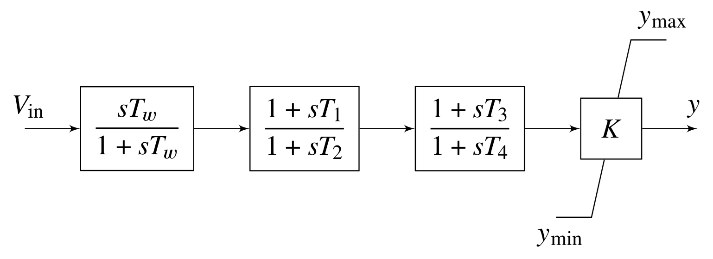

# Chapter 7: Power System Stabilizers
## Abstract
Power system stabilizers have been used for many years to add damping
to electromechanical oscillations. Essentially, they act through the
generator's excitation system in such a way that a component of
electrical torque proportional to speed change is generated (an
addition to the damping torque). Of course, it is easy to say that
this is done, and the mechanism varies depending on whether the mode
is a local mode or an inter-area mode. Nevertheless, an effective
stabilizer does produce a damping torque over a wide range of input
frequencies. Less effective stabilizers may only produce a damping
torque over a very small frequency range. This leads to problems when
system changes cause the system's oscillatory modes to change.

    <figure>
        
        <figcaption>Fig. 7.1: Block diagram of a typical power system stabilizer</figcaption>
    </figure>

[comment]: <> (eof)
