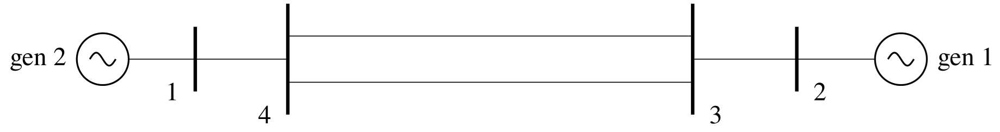

# Chapter 8: Power System Stabilizer Implementation---Problems and Solutions
## Abstract
In Chapter 7, we showed that power system stabilizers act efficiently
to damp the electromechanical oscillations in interconnected power
systems. When the stabilizers are correctly tuned, the resulting
damping control is robust. Power system stabilizers are cost effective
when compared to the alternative, purely electronic controls, e.g.,
static VAr compensators--we will consider these in
Chapter 10. However, over the years of power system stabilizer use, a
number of problems have arisen. These are often cited as reasons not
to install power system stabilizers, but this is not valid. Methods to
rectify the problems have been found and we will discuss the problems
and their solutions in some detail in this chapter.

    <figure>
        
        <figcaption>Fig. 8.1: Single-generator infinite-bus system</figcaption>
    </figure>

[comment]: <> (eof)
