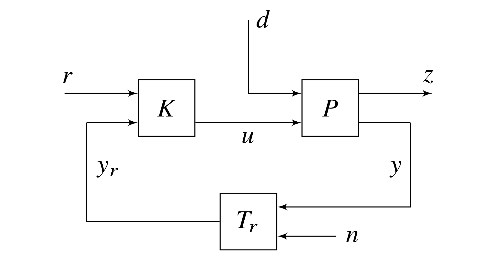

# Chapter 9: Robust Control
## Abstract
Control systems are often thought of in terms of a driving signal and
an output response, as a regulator in which a quantity must be kept
as constant as possible despite disturbances applied to the system,
or as a servomechanism. There are many regulators in power systems,
for example, the automatic voltage regulator and the governor; they
are necessary to ensure that the quality of the power supply is
maintained. In this chapter, we will put the requirements for robust
control in the context of power system small-signal stability. Of
necessity, the treatment will be brief. We recommend Feedback Control
Theory by Doyle, Francis and Tannenbaum, and Multivariable Feedback
Control by Skogestad and Postlethwaite for those interested in
learning more about this topic.

    <figure>
        
        <figcaption>Fig. 9.1: General control block diagram</figcaption>
    </figure>

[comment]: <> (eof)
